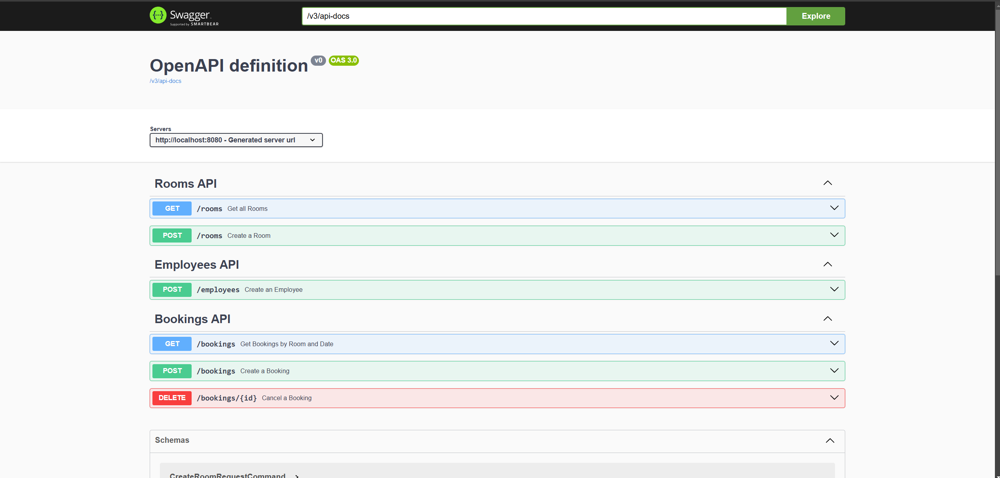

# ACME Room Booking System API

This project realizes the API for a meeting room booking system in an imaginary company called ACME Corporation. It is implemented using Java and the Spring Boot framework.

## Build & Deployment
### Prerequisites
- Docker should be installed on your system.

### Instructions
To get started, follow these steps:

```bash
git clone https://github.com/d-maniatakos/acme-room-booking-system.git
cd acme-room-booking-system
docker-compose up
```

## Testing
### Swagger
Visit [http://localhost:8080/swagger-ui/index.html](http://localhost:8080/swagger-ui/index.html) in order to access the Swagger API documentation UI page. You should see the following: <br></br>


### Postman
Open Postman Desktop Application and import __roombookingapi.postman_collection.json__ collection. You must be signed-in in order to be able to import collections.
